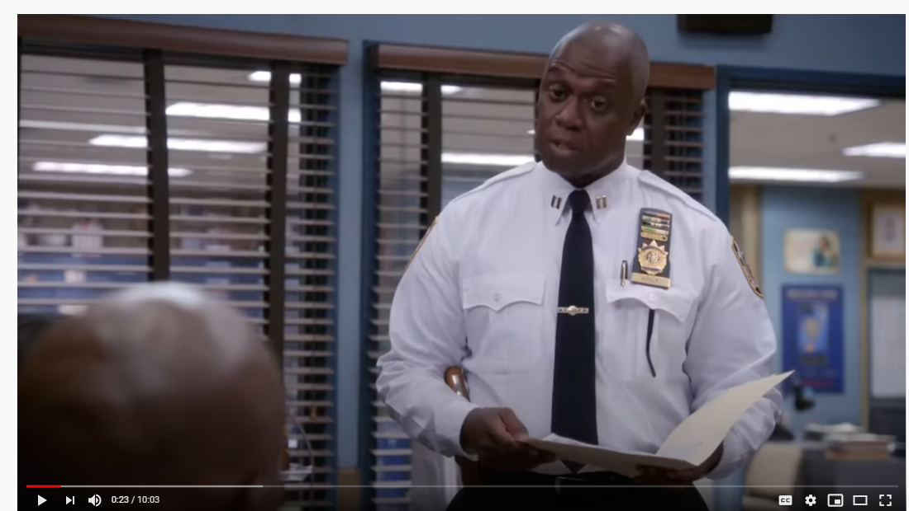

# 12 ball riddle that mention in broklyn 99 

 

---------

## Riddle
1) There is 12 ball that 11 of it has similar weight but 1 more item is have slightly different weight.
2) The abnormal ball could be heavier or lighter than others.
3) There is one scale to measure the ball.
4) Best amount of scale use is 3 times only.

can you achieve that.

coding instruction;

scaling will produce three result,
right is lighter,
right is heavier,
or scale balance.

so it meant in each of the scale interval only can use three if()else if() else{} three time only,
or one switch statement with three case.
ball setup there is 12 identical ball there place in array as weight 1.
one random ball  weight between  0 to 2 replace randomly in ball setup array.
if weight random ball equal to one the system will failed as 12 ball now identical

Checking.
There is while loop checking the riddle.

## how to run program
tsc riddle.ts
node riddle.js